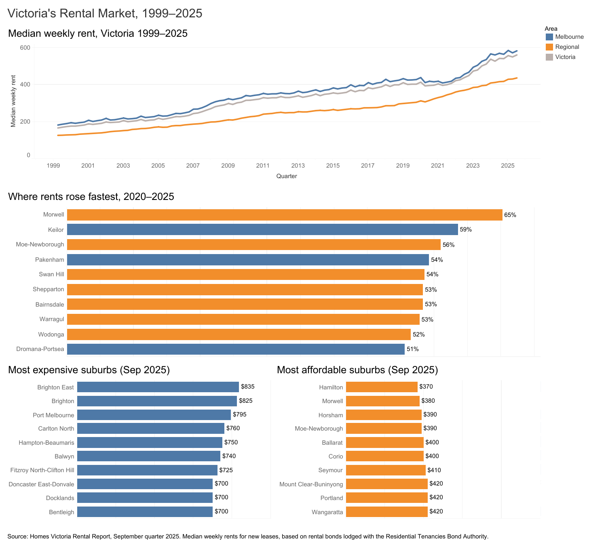

# Victoria's Rental Market, 1999–2025

An interactive Tableau dashboard exploring 25 years of rental prices across Melbourne and regional Victoria, built from the Homes Victoria Rental Report.

**[View the live dashboard on Tableau Public](https://public.tableau.com/app/profile/aaryan.attrish6246/viz/VictorianRentalMarket/VictoriasRentalMarket19992025)**



## Key findings

- Victoria's median weekly rent rose from **$390 in September 2020 to $550 in September 2025**, a sharper rise than across the whole previous decade.
- **7 of the 10 fastest-growing suburbs** between 2020 and 2025 were regional towns, led by Morwell (+65%), Moe-Newborough (+56%) and Swan Hill (+54%).
- The 10 most expensive suburbs are all in Melbourne (Brighton East, $835 a week), and the 10 most affordable are all regional (Hamilton, $370 a week).
- Morwell is both one of the most affordable places to rent and the fastest-growing, a sign of rent pressure spreading out of Melbourne.

## Data

Source: [Homes Victoria Rental Report](https://www.dffh.vic.gov.au/publications/rental-report), September quarter 2025, published under a Creative Commons Attribution 4.0 licence. Figures are median weekly rents for new leases, based on rental bonds lodged with the Residential Tenancies Bond Authority.

Two tables are used:

| File | What it contains |
|---|---|
| Quarterly median rents by Local Government Area | Quarterly medians for 79 councils, June 1999 to September 2025 |
| Moving annual median rent by suburb and town | 12-month moving medians for 146 suburbs and towns, March 2000 to September 2025 |

Each table covers seven property types (1–3 bedroom flats, 2–4 bedroom houses, and all properties).

## Data cleaning

The original Excel files are in a wide format that is hard to analyse: each sheet is one property type, each quarter is a pair of Count and Median columns, region names appear only on the first row of each group, and suppressed values are shown as "-".

`clean_rental_data.py` converts them into tidy long-format CSVs (one row per area, property type and quarter) by:

- combining all seven sheets in each file and reshaping from wide to long
- filling down region names and converting quarters into proper dates
- treating suppressed values ("-", too few bonds to publish) as missing
- tagging region and state total rows with a `level` column so they can be filtered out and never double counted
- removing a duplicated Victoria total in the LGA file
- fixing name errors in the source ("Mornington Penin'a" → "Mornington Peninsula", "Wanagaratta" → "Wangaratta")
- adding a Metropolitan Melbourne / Regional Victoria flag
- checking for duplicate rows

## Dashboard

Built in Tableau Public with four views:

1. **Median weekly rent, 1999–2025:** long-term trend for Melbourne, regional Victoria and the state overall
2. **Where rents rose fastest, 2020–2025:** top 10 suburbs by percentage increase, using a calculated field and context filters so the Top N ranking is computed on the right subset
3. **Most expensive suburbs (Sep 2025)**
4. **Most affordable suburbs (Sep 2025)**, on the same fixed axis as the most expensive chart so the two compare honestly

## Repository structure

```
├── clean_rental_data.py     # cleaning script
├── requirements.txt
├── data/
│   ├── raw/                 # original Excel files from Homes Victoria
│   └── clean/               # tidy CSVs used in Tableau
└── images/
    └── dashboard.png
```

## How to run

```bash
pip install -r requirements.txt
python clean_rental_data.py
```

The cleaned CSVs are written to `data/clean/`. To update for a new quarter, download the latest Rental Report tables into `data/raw/`, update the two file names at the top of the script, and run it again.

## Tools

Python (pandas, openpyxl) · Tableau Public

---

Created by Aaryan Attrish, Master of Data Science student at Monash University.
